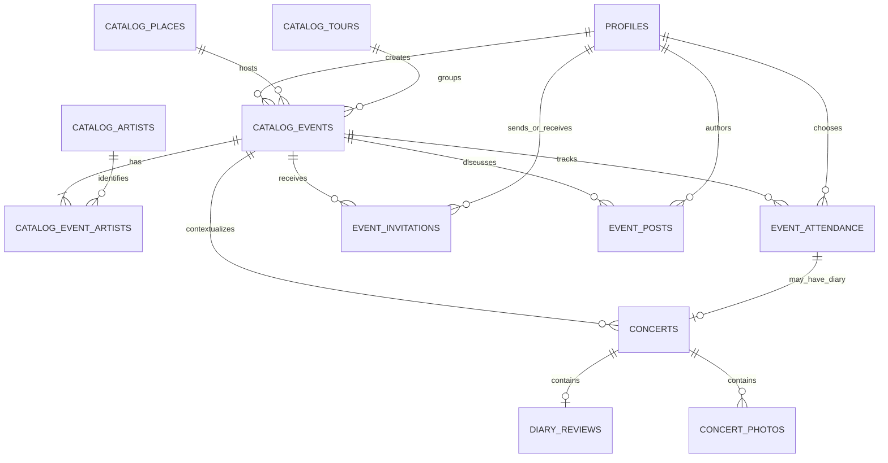

# Community Events Implementation Plan

Status: in progress; Phase 1 implemented for the disposable Local environment
Decision date: 2026-07-16
Decision owner: Ethan
Depends on: `docs/community-events-product-design.md` and
`docs/musicbrainz-catalog-implementation-plan.md`

## Implementation progress

- Phase 0 is implemented behind the Development-only `community-events`
  scenario. It exercises Feed, Plans, concert-first discovery, MusicBrainz-backed
  event creation, shared Event/People/Memories detail, attendance, invitations,
  conversation, and personal diary composition without changing the live app.
- Phase 1 database foundations are implemented in
  `20260716180000_community_event_foundation.sql`: provider-neutral event rows,
  catalog lineups, listed/unlisted access, merge/tombstone-ready state, immutable
  activity, private reports/revisions, exact-duplicate locking, creation quotas,
  and bounded search/detail/create/update/report RPCs.
- The Phase 1 iOS repository is connected to disposable Local Supabase for real
  search, detail, canonical creation, and MusicBrainz-first catalog selection.
  Capability gating keeps later-phase controls out of the live surface, while the
  fixture scenario retains the complete product journey for design work. Hosted
  Development remains unchanged until this migration is reviewed and deployed.
- Phase 2 and later persistence contracts have not started.

## Architecture decision

Add a provider-neutral event occurrence layer on top of the implemented music
catalog. Do not add `event` to `catalog_entity_kind`: an event is a dated occurrence,
not a reusable identity selected in artist, place, song, or tour pickers.

Event creation must use the existing MusicBrainz gateway and tunedIn UUID resolution
as its default identity path. Custom catalog creation remains available only after
a meaningful search fails or the creator deliberately selects a previously saved,
clearly labeled custom identity. No event mutation accepts identity strings.

Use the database name `catalog_events` because `concert_events` already stores the
existing immutable activity log. User-facing copy should simply say `concert` or
`event`.

Keep the existing `concerts` records operational while the new model expands. New
personal diaries will initially reuse that mature record, media, comments, caching,
and activity infrastructure through additive event/attendance links. Existing
shared concerts become `legacy_shared` diaries and remain readable and editable
under their current rules until a later contract migration is explicitly approved.

This expand/migrate/contract approach avoids a destructive table rename and lets
the discovery/Going loop ship before diary migration is complete.

## Target data model

The names below are the intended contract; migrations may refine field names while
preserving the boundaries.

### `catalog_events`

One canonical shared occurrence:

- `id uuid primary key`;
- `created_by uuid` for audit and quota enforcement, not ownership;
- required `catalog_place_id`, derived nullable `catalog_area_id`, optional
  `catalog_tour_id`;
- `event_date date`, optional `starts_at timestamptz`, and venue IANA time zone;
- backend-derived `memory_unlock_at timestamptz`;
- lifecycle: `scheduled`, `postponed`, `cancelled`, or `completed`;
- listing: `listed` or `unlisted`;
- integrity: `community_added`, `corroborated`, or `disputed`;
- row state: `active`, `merged`, or `tombstoned`, with nullable
  `merged_into_event_id`;
- monotonic `version`, timestamps, and last material activity time;
- server-derived venue, city, tour, date, and time-zone snapshots for cheap display
  and future resilience.

Foreign keys to a merged catalog artist/place/tour resolve to its canonical entity
at write time. Event rows do not call MusicBrainz directly.

### `catalog_event_artists`

Ordered lineup rows with:

- event and catalog artist IDs;
- lineup position and one primary/headliner marker;
- server-derived artist display snapshot;
- optional billing role later, without changing identity.

The initial limit should match the existing maximum lineup size unless a separate
product decision expands it.

### `event_attendance`

One row per profile and event:

- state: `going`, `went`, or `did_not_go`;
- audience: `private`, `friends`, or `community`;
- timestamps for creation, confirmation, and update;
- unique `(event_id, profile_id)`;
- nullable `event_id` only after an admin-only legal/safety detach, paired with a
  detached timestamp and a generic history marker;
- `ON DELETE RESTRICT` from attendance to the event.

All writes go through hardened RPCs. Removing Going before the event may delete a
planning-only row if it has no invitation-history requirement; after the event,
`did_not_go` is preferable so reminder state remains deterministic. Only `going`
and `went` are exposed on profiles or attendee lists.

### `event_invitations`

Private sender-recipient state:

- event, sender, and recipient IDs;
- `pending`, `accepted`, `declined`, or `withdrawn`;
- created/responded timestamps;
- one active invitation for a sender/recipient/event tuple;
- recipient-side read and response permissions only.

Accepting an invite transactionally creates or preserves the recipient's Going row
with the recipient's chosen/default audience. It never changes the sender's
attendance.

### `event_posts`

Upcoming event conversation:

- event, author, optional parent post, body, audience, timestamps, and soft-delete;
- audience is `friends` or `community`;
- replies are limited to one level in the MVP;
- normalized text limit and backend rate limits reuse the current comment security
  posture;
- posts do not support media initially.

Friends visibility is evaluated between viewer and author at read time. It does not
mean every attendee can read the post. New posts and replies are rejected at
`memory_unlock_at`; existing planning discussion remains readable under its current
audience.

### Personal diary extension

Add to `concerts`:

- nullable `catalog_event_id` with `ON DELETE SET NULL` only for the exceptional
  legal-erasure path;
- nullable `attendance_id` pointing to the author's attendance row;
- `record_model`: `legacy_shared` or `personal_diary`;
- for personal diaries, an independent `diary_audience`: `private`, `friends`, or
  `community`;
- optional publication timestamp and detached-event reason.

Add a partial unique index so one profile can have at most one non-deleted personal
diary per event. New personal diaries have exactly one author and no collaborators.
Existing concert visibility and collaborator rules continue only for
`legacy_shared` rows during expansion.

Add `diary_reviews`, one-to-one with a personal diary:

- optional overall score;
- optional performance score;
- optional normalized review body;
- created/updated timestamps.

Use a fixed integer storage scale even if the UI presents halves—for example 1–10
stored points rendered as 0.5–5.0 stars. Database checks own the range. A published
diary must have at least one score, a review body, or one ready photo; drafts may be
empty. The database must also enforce that a personal diary's author, event, and
linked attendance row agree.

Existing `concert_photos`, comments, artist snapshots, and setlist items remain
attached to `concerts`. This preserves current media and offline behavior. Global
event setlists and per-song ratings are separate future structures; do not make one
person's diary setlist canonical for everyone.

### Activity and notification projection

Add immutable `social_activity_events` for new event-domain actions rather than
overloading the already-shipped `concert_events` table:

- actor ID, action type, event ID, optional attendance/diary/post subject ID;
- occurred time and non-content metadata;
- action types for Going, Went, invitation acceptance, diary publication, diary
  media, event post/reply, and material event correction.

A unified feed RPC may union legacy `concert_events` projections with new social
activity projections until legacy collaboration is contracted. Read-time audience,
friendship, blocks, tombstones, and current event access must be applied before a
row is returned.

Use a private outbox for direct notifications. Store only opaque IDs and action
types. Do not copy post, review, caption, profile, or event text into notification
rows.

## Read contracts

Prefer purpose-built, cursor-paginated RPCs over broad client table reads:

- `search_catalog_events(query, filters, cursor, limit)`;
- `get_catalog_event_detail(event_id)`;
- `list_event_attendees(event_id, scope, cursor, limit)`;
- `list_my_plans(range, cursor, limit)`;
- `list_event_posts(event_id, scope, cursor, limit)`;
- `list_event_diary_previews(event_id, scope, cursor, limit)`;
- `list_profile_attendance(profile_id, state, cursor, limit)`;
- extended `list_friends_activity(...)` or a versioned replacement.

Event search should initially use Postgres indexes over derived headliner, venue,
city, and date values. It can search globally visible event snapshots even when an
attached custom catalog entity is not globally suggested by the music catalog.
Search should prefer upcoming rows, exact catalog identity matches, geographic
relevance when the user has explicitly provided a location, and then date.

The add-event catalog controls should rank resolved MusicBrainz-backed identities as
the normal path, visually separate reusable custom entries, and keep new custom
creation behind `Can't find it? Add to tunedIn catalog`. This is identity fallback,
not permission to save arbitrary event strings.

Avoid embedding complete attendees, posts, and diaries in one event-detail payload.
Return summary counts and small friend previews, then page each section. This keeps
popular events bounded.

## Mutation contracts

Use narrowly scoped, fixed-`search_path`, authenticated hardened RPCs:

- `create_catalog_event(...)` and `update_catalog_event(...)`;
- `report_catalog_event(...)` and privileged merge/tombstone operations;
- `set_event_attendance(event_id, state, audience)`;
- `send_event_invitation(...)` and `respond_to_event_invitation(...)`;
- create/edit/delete event post and reply operations;
- `create_personal_diary(event_id, audience)`;
- `save_diary_review(...)` and `publish_personal_diary(...)`;
- `set_diary_audience(...)` and `detach_personal_diary(...)`.

Event creation must atomically:

1. validate the catalog place, area, artists, and optional tour;
2. accept only existing tunedIn UUIDs created through MusicBrainz resolution or the
   controlled custom-catalog RPC, then resolve merged catalog IDs;
3. check exact duplicate keys under a transaction/advisory lock;
4. derive all display snapshots, event time zone, and unlock time;
5. enforce per-account creation quotas;
6. insert the event and immutable activity row;
7. return the canonical existing row on an exact duplicate race.

The client submits catalog IDs and structured dates/times, never authoritative
artist, venue, city, or tour strings.

## Authorization boundary

RLS and RPCs, not Swift visibility checks, own every rule.

- Listed active events are readable by completed authenticated profiles.
- Unlisted events require creator, invite, attendance, diary, or explicit admin
  access.
- Attendance is readable by its owner and by viewers allowed by its audience and
  current relationship state.
- A block overrides friendship, community audience, invitations, feeds, posts, and
  diary previews immediately.
- Diary media and comments inherit the diary's current audience.
- Invitations are sender/recipient-only and rate limited at the database boundary.
- Event edits never grant access to another user's attendance or diary.
- Direct table mutation remains revoked for ordinary clients.
- Merge, tombstone, legal erase, and high-impact corrections are privileged and
  auditable.

Every migration that changes this boundary requires real pgTAP tests against the
ephemeral local Supabase stack. Client fakes do not count as authorization proof.

## iOS architecture

Add event-domain types and repositories without making the existing
`ConcertRepository` responsible for global discovery:

- `EventRepository`: search, event detail, create/correct, attendee summaries;
- `AttendanceRepository`: Going/Went and Plans;
- `InvitationRepository`: send, inbox, and response;
- `EventPostRepository`: event conversation;
- evolve `ConcertRepository` toward personal diary operations while retaining its
  legacy compatibility surface.

Development repositories and SwiftData caches must model the same identities,
audiences, and lifecycle states as Supabase. Cached event detail uses a short
freshness window; user plans and private diary content must be invalidated on
audience/access changes and sign-out.

Suggested feature boundaries:

- `Features/EventSearch`;
- `Features/EventDetail`;
- `Features/Plans`;
- `Features/EventCreation`;
- `Features/EventConversation`;
- `Features/Diary`.

Do not reorganize unrelated existing folders solely to match these names.

The Mobbin research and holistic current-UI mapping in
`docs/community-events-product-design.md` should inform prototypes across these
features. It is not a pixel or component contract. Existing root navigation,
creation, archive, Feed, Profile, and concert-detail composition may change when the
complete search-to-plan-to-diary journey becomes clearer; catalog, media,
authorization, loading, accessibility, and contextual-control infrastructure should
be reused where it still fits.

## Phased implementation

For this execution, every major phase is a focused commit on one implementation
branch and one cumulative draft pull request. The PR summary gains a new Major
steps entry after each commit.

### Phase 0 — contract fixtures and navigation shell

Implementation status: complete behind a Development-only launch scenario.

- Inventory current screens as `reuse`, `reshape`, `split`, or `legacy-only` against
  the holistic mapping in the product design.
- Add deterministic models and development-repository scenarios for listed,
  unlisted, upcoming, past, cancelled, duplicate, friends/community/private
  attendance, and attendance without diary.
- Prototype the whole fixture-backed path—Feed, concert search, shared event, Plans,
  profile attendance, and personal diary—before optimizing any one screen.
- Replace the direct `Log concert` entry with a fixture-backed `Find or add concert`
  path and add Plans without removing access to the current diary archive.
- Exercise the existing contextual bottom control region with upcoming-event and
  past-event actions; keep the exact visual treatment exploratory.

Exit: the complete search-to-plan-to-diary navigation can be exercised without a
backend migration, the legacy archive remains reachable, and the first UI PR clearly
identifies which existing components are being reused versus replaced.

### Phase 1 — global community event foundation

Implementation status: complete in the disposable Local environment; hosted
Development remains gated until the reviewed migration is deployed.

- Add event, lineup, state, listing, merge/tombstone, and activity tables.
- Add creation, detail, exact-duplicate, correction/report, and search RPCs.
- Reuse existing MusicBrainz/tunedIn catalog IDs and derived snapshots.
- Add RLS, direct-write revocation, quotas, pgTAP tests, generated Swift DTOs, and
  deterministic seeds.
- Implement event search, add-concert fallback, and shared event header/detail.

Exit: a signed-in user can search, add, reopen, and safely view a community event;
an exact duplicate race cannot create two canonical rows.

### Phase 2 — Going, attendee discovery, and Plans

- Add attendance tables/RPCs and audience-aware attendee/profile reads.
- Implement one-tap Going, audience control, cancellation, and Went confirmation.
- Build Plans list first, then its calendar toggle.
- Add friend previews to event and plan rows.
- Extend seed journeys and authorization tests for friendship removal and blocks.

Exit: two real local users can mark Going with different audiences, see only the
permitted rows, and retain an attendance-only Went history.

### Phase 3 — invitations and upcoming conversation

- Add invitations, event posts/replies, rate limits, soft deletion, and private
  notification outbox events.
- Implement invite chooser/inbox/response and event conversation.
- Accepting an invite creates Going transactionally; declining does not.
- Add feed projections for visible Going and invitation acceptance.

Exit: a user can invite a friend, the friend can accept, both see the correct Plans
state, and blocked or unauthorized users cannot read or mutate the records.

### Phase 4 — link personal diaries to events

- Expand `concerts` with event/attendance/model/audience/publication fields and add
  `diary_reviews`.
- Mark all current rows `legacy_shared` without changing their current access.
- New past-event flow creates a `personal_diary` and keeps its audience independent
  of attendance.
- Reuse current photo album and comment infrastructure under diary authorization.
- Add friend/community diary previews and aggregate scores to past event detail.
- Add profile Went and Diary sections and unified feed projections.

Exit: each user can have an independent diary for one event, attendance can exist
without a diary, and changing one diary's audience immediately changes all of its
review/media/comment reads.

### Phase 5 — integrity and resilience operations

- Implement reviewed event merge, conflict handling, redirect tombstones, and event
  correction history.
- Add an admin-only legal/safety detach operation with immutable audit records.
- Add a runbook when these high-impact operations are first implemented.
- Exercise diary and attendance durability through merge, cancellation, tombstone,
  and exceptional detach paths.

Exit: no supported event lifecycle operation can cascade-delete a user's attendance
or diary, and operators have a tested recovery procedure.

### Phase 6 — provider readiness, not provider integration

- Add `event_sources` only when a real provider or external URL workflow is
  approved.
- Keep the tunedIn event UUID canonical and attach provider identifiers with unique
  `(provider, external_id)` constraints.
- Design refresh cadence, licensing-compliant field persistence, stale-source
  behavior, affiliate attribution, and provider-specific monitoring at that time.

Exit: deferred until a separate Ticketmaster/provider decision. No Ticketmaster
credential, API call, cron job, or affiliate link belongs in Phases 0–5.

## Required tests and verification

Backend behavior tests must cover:

- listed versus unlisted event reads;
- exact duplicate race behavior and near-duplicate non-merging;
- catalog kind, merged-ID, venue/area, date/time-zone, and lineup validation;
- creation and invite quotas;
- all attendance and diary audience combinations;
- friendship acceptance/removal and block revocation;
- event-post author, audience, reply-depth, deletion, and rate-limit rules;
- invitation send/respond/replay/blocked-user behavior;
- unlock-time enforcement and Going not automatically becoming Went;
- one personal diary per user/event and publication content requirements;
- no private review, post, caption, or address leakage through feeds, counts,
  previews, Realtime, errors, or notification outbox;
- merge/tombstone/detach durability and conflict handling;
- legacy shared concert behavior remaining unchanged during expansion.

For each schema phase:

- update `supabase/seeds/development.sql` with real end-to-end journeys;
- run `make backend-verify` and `make local-seed-verify`;
- regenerate and commit Swift DTOs with `make generate`;
- run `make lint` and `make test`;
- exercise affected UI in the iPhone 13 Simulator and visually inspect it;
- add or update a runbook only when the high-impact operation actually exists.

## Rollout and compatibility

Use capability/version checks so a reviewed client can coexist briefly with the
previous Development schema. New additive fields should not cause old clients to
create community events accidentally. Do not remove legacy RPCs or collaboration
behavior in the same release that first adds personal diaries.

Suggested release gates:

1. internal fixtures and local Supabase;
2. reviewed Development migration from `main`;
3. Development integration with at least two real accounts;
4. Staging/TestFlight promotion after backend and client are compatible;
5. explicit review of community moderation load before broadening Community
   audiences or event creation.

## Plan exit condition

The implementation plan is complete when the product exit condition in the design
document is verified against real Supabase sessions, no current concert memory is
lost or silently reinterpreted, and Ticketmaster remains an optional future source
rather than a runtime dependency.
