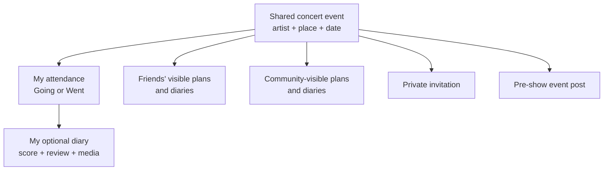

# Community Events, Attendance, and Diaries Product Design

Status: approved product direction; detailed defaults proposed for review
Decision date: 2026-07-16
Decision owner: Ethan

## Decision

tunedIn will center the product on a shared catalog of concert events created by the
community. A concert event is the common page for factual show details, plans,
attendees, invitations, and conversation. It is not owned by the person who first
adds it.

Each person then has independent social and memory layers beneath that event:

- **Going** is a future plan with its own audience.
- **Went** is a confirmed attendance record and does not require a diary.
- A **diary** is an optional personal account with a score, review, and media.
- An **invite** is a private request from one user to another.
- An **event post** is lightweight pre-show conversation for friends or the signed-in
  tunedIn community.

Ticketmaster and other event providers are deferred. The first release will use
community-created events and the existing MusicBrainz/tunedIn catalog for artist,
venue, area, and tour identities. A future provider may enrich an existing tunedIn
event but will never become its permanent application identity.

Community-created does not mean free-form by default. Event creation is
**MusicBrainz-first**: creators search and resolve MusicBrainz-backed catalog
identities before tunedIn offers a custom artist, venue/area, or tour as the
last-resort path. This keeps community events consolidated even without an event
provider.

This design supersedes the external MVP document for event discovery, attendance,
and diary behavior. The MusicBrainz catalog implementation remains authoritative
for reusable music identities.

## Product promise

> Find the show, see which friends are going, make the plan together, and remember
> it your own way afterward.

The product should answer four questions with very little navigation:

1. Is the concert already in tunedIn?
2. Which of my friends are going?
3. Who should I invite?
4. What did my friends and the wider community think afterward?

## Core mental model

The shared event supplies context. It must not become a group-owned diary. Two
friends at the same show may rate it differently, attach different media, write
different reviews, and choose different audiences.

The shared event may also have one event-specific cover image. A community creator
can add it during concert creation; a future trusted importer can supply it with
provider and license provenance. The cover belongs to the dated event, not the
artist identity, because different tours and dates may need different imagery. If
a community creator does not upload one, the interface keeps the existing compact
date-led concert treatment rather than inventing artwork.

## Event lifecycle

### Before the show

The event page supports:

- one-tap **I'm going** and **Not going anymore**;
- friend and opted-in community attendee previews;
- in-app friend invitations;
- a chronological event conversation with `Friends` and `Community` audiences;
- date, time, venue, lineup, tour, and community-source details;
- correction and duplicate-report actions.

At `memory_unlock_at`, the planning conversation becomes read-only. Post-show
discussion belongs on individual diaries, where its author and audience are clear.

Going defaults to **Friends** visibility. A user may instead choose **Private** or
explicitly opt into **Community**. A public profile never automatically makes future
plans public.

### After the show

At the backend-calculated `memory_unlock_at`, the event page changes from planning
to memories:

- a Going user is prompted to confirm **Went** or **Didn't go**;
- any user may mark **Went** without creating a diary;
- an attendee may create one personal diary for the event;
- friend diary previews appear before community diary previews;
- aggregate scores include only visible diaries that contain an overall score;
- tapping a preview opens that person's full diary under its audience rules.

Going never automatically becomes Went. The product can remind the user, but the
user must confirm attendance.

For the MVP, a diary may contain an optional overall score, optional performance
score, review text, and photos. It must contain at least one of score, review, or
media before publication. Video uploads and per-song ratings are later work because
their moderation, storage, rights, and playback costs are materially different.

### Unlock calculation

The database owns the transition; clients cannot unlock a show early.

- With a known start time, use four hours after `starts_at`.
- With a date but no time, use 3:00 a.m. on the following day in the venue's time
  zone.
- A factual event correction may recalculate the unlock time while the event is
  still upcoming.
- A cancelled event remains viewable, but diary creation stays locked unless a user
  explicitly confirms the performance occurred.

## Information architecture

The first navigation model is:

- **Feed** — friend activity and direct social updates.
- **Plans** — the user's upcoming events, list/calendar switching, and friend faces.
- **Profile** — Went history, diary entries, and audience-aware profile viewing.
- A prominent **concert search** action available from Feed and Plans.

Search is an action, not an Explore tab. The MVP does not need an editorial or
algorithmic Explore surface.

### Search and add flow

1. Search global events by artist, venue/city, and date.
2. Show upcoming matches first and clearly separate past matches.
3. Open a result directly to the shared event page.
4. If there is no correct result, offer **Add concert** after the results.
5. Require artist, venue, and local date. Time and tour are optional.
6. Reuse the existing catalog pickers, prioritizing MusicBrainz-backed results.
7. Only after a meaningful search has no correct identity, expose the controlled
   **Add to tunedIn catalog** fallback. Previously created personal catalog entries
   remain reusable but are visibly distinguished from MusicBrainz-backed results.
8. Show likely event duplicates before creation; never silently fuzzy-merge them.
9. After creation, offer **I'm going** as a separate action. Creation itself does
   not imply attendance.

A fast past-memory flow may combine `find or add event -> mark Went -> start diary`
in one transaction from the user's perspective, while retaining the separate data
records underneath.

### Shared event page

Keep one stable page and adapt its emphasis by phase:

1. Factual header: lineup, date/time, venue/city, tour, status.
2. Primary action: Going before the show; Went/Add diary afterward.
3. Friends going or friends who went.
4. Invite friends.
5. Upcoming: event conversation. Past: friend diary previews and scores.
6. Community attendees, posts, and diary previews when the viewer chooses to expand
   them.
7. Quiet provenance: **Details added by the tunedIn community**.

There is no empty diary created when someone taps Going or Went.

### Plans and profile

Plans defaults to a chronological list because it carries more social context than
a month grid. A calendar toggle is secondary. Each row shows the show, date, venue,
the user's attendance state, and a compact friend-going preview.

The profile separates:

- **Going**: upcoming attendance visible to the current viewer;
- **Went**: confirmed history, including attendance-only rows;
- **Diary**: richer published memories.

An attendance-only history row says the user went but exposes no score, review, or
media. A diary card is visibly richer and opens the full entry.

## Audience and privacy contract

Audiences are attached to user actions, not inferred from profile visibility.

| Record | Private | Friends | Community |
| --- | --- | --- | --- |
| Going | Only the user | Accepted friends | Signed-in tunedIn users |
| Went | Only the user | Accepted friends | Signed-in tunedIn users |
| Diary | Only the author | Accepted friends | Signed-in tunedIn users |
| Event post | Not applicable | Accepted friends of the author | Signed-in tunedIn users |
| Invite | Sender and recipient only | Not applicable | Never |

Defaults:

- Going: Friends.
- Went: inherit the latest attendance audience, with a confirmation control.
- Diary: Friends, independent from attendance.
- Event post: remember the user's last explicit choice, initially Friends.

Changing an audience applies immediately to future reads and feed projections.
Previously cached private content must be evicted or cease rendering on the next
authorization refresh. Notifications contain only opaque IDs and generic action
labels, never review, comment, caption, or event-post text.

Community means authenticated tunedIn members in the MVP, not an anonymous web
audience. Public web sharing can be designed separately with explicit consent.

## Community event policy

### Catalog selection hierarchy

Every community event still uses stable tunedIn catalog UUIDs. The preferred source
of those identities is MusicBrainz:

1. reuse an already-resolved MusicBrainz-backed tunedIn catalog row;
2. search MusicBrainz through the existing gateway and resolve the chosen candidate
   into a tunedIn UUID;
3. reuse the creator's clearly labeled custom catalog entry when it is the known
   correct local identity;
4. create a new custom tunedIn entry only after search fails.

The client never saves authoritative free-text artist, venue, city, or tour values
on an event. A custom identity attached to a listed event can render and participate
in event search through the event's derived snapshot, but it does not automatically
become a globally suggested catalog result. Later reviewed reconciliation may merge
it into a MusicBrainz-backed identity without changing the event UUID.

### Listed and unlisted events

A normal concert at a public venue is listed and searchable by signed-in users. An
invite-only show, house concert, or sensitive location may be unlisted. Unlisted
events are visible only to the creator, invited users, and users who have attached
attendance; their exact address must not appear in search or feed payloads.

This supports concerts outside ticketing platforms without turning every private
address into community discovery data.

### Contributors, not owners

The creator is recorded for audit and abuse controls, but cannot delete the shared
event after others use it. Authorized contributors may propose factual corrections.
Sensitive changes—date, venue, headliner, cancellation, or merge—must be versioned
and may require corroboration or moderation once the event has other participants.

### Duplicate and merge behavior

Creation checks candidates using headliner catalog ID, venue catalog ID, and local
date, then widens to same artist/city/nearby date. Similarity produces a warning,
not an automatic merge.

When two rows are confirmed duplicates:

- choose one canonical tunedIn event UUID;
- repoint attendance, invitations, posts, and diary links transactionally;
- resolve same-user attendance and diary conflicts explicitly;
- preserve an immutable merge record;
- leave the old event as a redirect tombstone.

The same mechanism later allows a community event to receive a Ticketmaster or
other provider reference without changing its tunedIn UUID.

### Deletion and memory durability

Ordinary event deletion is prohibited after any dependent user record exists.
Incorrect, cancelled, or duplicate events become unlisted, cancelled, disputed,
merged, or tombstoned; a minimal factual row remains so attendance can render.

Diaries also retain server-derived event, lineup, venue, and date snapshots. If a
legal or safety requirement ever demands true event erasure, a privileged audited
operation must first detach each diary while retaining only the minimum permitted
snapshot. Attendance-only history may retain a generic `Past concert` marker when
the underlying facts may not legally remain. No foreign key from user memory may
cascade-delete a diary or attendance record.

## Feed and notifications

The friend feed may include:

- a friend marked Going with the audience permitting the viewer;
- a friend accepted an invitation;
- a friend confirmed Went;
- a friend published or materially updated a diary;
- a friend added diary photos;
- a friend posted or replied in an event the viewer can access.

Avoid one activity item per minor edit. Diary publication is a strong event; rating
and review edits should update its preview rather than spam the feed.

Direct invites, replies, event cancellations, and material schedule changes are
notification-worthy. Generic friend activity belongs in the in-app feed first and
may later use an optional digest. Push preferences and APNs delivery are not required
for the first community-event slice.

## Mobbin UI inspiration

Research date: 2026-07-16

This section is a reference library, not a UI specification or acceptance checklist.
The linked products solve adjacent problems with different business models,
audiences, and platform eras. Borrow the interaction idea only when it makes the
tunedIn flow clearer in a prototype. Do not copy a screen wholesale, and do not let
these references override native iOS behavior or the repository's navigation
guidance.

### Holistic evolution of the current app

The existing Feed/Profile shell and current concert screens are implementation
assets, not product constraints. The community-event direction is broad enough to
recompose the existing interface when that produces a clearer end-to-end journey.
This is preferable to attaching discovery and Going as side features around a UI
whose center of gravity is still `Log concert`.

Shell references:

- [Partiful's event-centered home and search shell](https://mobbin.com/screens/720a28b0-9df9-442c-8525-558fb3842ccf)
- [BFF's My Events profile view](https://mobbin.com/screens/32f3e8cd-6243-4df9-a7e9-b9e4575d86c6)
- [Partiful's contextual event action bar](https://mobbin.com/screens/d4e3b2a7-69c9-4776-be64-7f952d5bcaf3)
- [Beli's feed-oriented application shell](https://mobbin.com/screens/3ee1c49d-56c5-45e6-9ec5-b6cf2e059ffa)

A promising holistic structure to prototype is:

- **Feed:** friend actions and diary previews, with direct paths into the shared
  event or the friend's diary.
- **Plans:** the user's Going events, invitations, friend-going context, and optional
  calendar view.
- **Profile:** Going, attendance-only Went, and published Diary history.
- **Concert search:** the dominant global utility, available from Feed and Plans
  without requiring an Explore destination.
- **Find or add concert:** the replacement for the current direct `Log concert`
  action. Search for the shared event first; only then add a missing event, mark
  Going/Went, or start a diary.
- **Shared event detail:** the common source-of-truth page that changes emphasis from
  planning to memories over time.
- **Personal diary detail:** a separate author-owned view for score, review, photos,
  and comments. It should not inherit global event-edit ownership semantics.

Current UI mapping:

| Current experience | Holistic evolution to explore |
| --- | --- |
| Feed/Profile root switcher | Feed/Plans/Profile, with concert search as a persistent utility rather than a tab |
| Left-side People search | Concert-first search with People as a secondary scope or contextual friend action |
| Trailing `Log concert` button | `Find or add concert`, preserving search-before-create and separating event creation from attendance/diary creation |
| Concert archive | Profile Went and Diary sections; upcoming records move to Plans |
| One `Concert / People / Photos` detail | Shared Event sections for overview, attendees, conversation, and diary previews; separate Personal Diary detail for one author's memory |
| Shared concert collaborators | Legacy behavior only; new events have contributors and new diaries have one author |
| One feed-card density | Compact cards for Going/invites and richer cards for published diaries |
| Profile as diary archive | Social identity plus distinct Going, Went, and Diary views under current audience rules |

Existing work worth carrying forward includes the MusicBrainz/tunedIn catalog
pickers, photo upload and album infrastructure, contextual bottom liquid-glass
control region, loading/error/accessibility patterns, and the underlying
friend/block authorization model. Their current screen arrangement does not need to
be preserved.

The contextual bar can also evolve with the page. Partiful's bar is useful
inspiration because status and invitation stay near the thumb, but tunedIn should
use its own adaptive liquid-glass control vocabulary. An upcoming event might
surface Going and Invite; the same event after unlock might surface Went and Add
Diary. Exact control count, grouping, and stickiness remain prototype decisions.

The holistic prototype should cover existing data as well as greenfield states:

1. a user with no plans or diaries searches and adds an upcoming concert;
2. a user marks Going, invites a friend, and returns through Plans;
3. the event unlocks, the user confirms Went, and optionally creates a diary;
4. a friend opens that diary from Feed and then returns to the shared event;
5. a profile shows Going, attendance-only Went, and rich diary entries together;
6. an existing legacy shared concert remains reachable without pretending it uses
   the new personal-diary model.

This authorizes redesign of existing screens, but does not require change for its
own sake. Preserve components that support the new mental model; replace or split
screens whose current responsibilities make that model confusing.

### Cohesive inspiration direction

The most promising combination is:

- **Spotify and DICE for concert utility:** fast event scanning, recognizable date
  and venue hierarchy, and a factual event detail page.
- **Luma, Partiful, and GroupMe for social planning:** visible attendance state,
  friend faces near the decision, direct invitation, and understandable plan status.
- **Beli and Retro for the memory layer:** one shared destination with independent
  personal entries, friend-first social proof, and media that feels like a durable
  memory instead of a generic post.
- **Facebook, LinkedIn, Beli, and Waze for trust:** audience choice at the point of
  action and correction/report flows that describe consequences before mutation.

The resulting tunedIn experience should feel like one concert changes phase over
time—not like an events app, a chat app, and a diary app stitched together. The same
event identity and factual header can remain stable while the primary action and
social sections move from planning to memories.

### Discovery and concert search

References:

- [Spotify Live Events discovery flow](https://mobbin.com/flows/38636675-e29f-49d8-bd3c-f344656cf3fb)
- [DICE event-detail flow](https://mobbin.com/flows/4b25715a-9191-47c2-9384-2d484b81625f)
- [Hypelist search with a manual fallback](https://mobbin.com/screens/bf3a112c-29db-47c5-a5d7-487c4a9f6665)
- [Artsy artist search with disambiguating metadata](https://mobbin.com/screens/237eb9d2-4f34-4edb-9753-970081cdb6ff)

Ideas worth prototyping:

- Spotify's compact date badges and artist/venue/date scanning rhythm for upcoming
  results.
- DICE's strong event identity and progressive disclosure of factual details.
- Artsy's two-line identity results—name plus type, location, or life-span context—
  for MusicBrainz-backed artist and venue selection.
- Hypelist's visually subordinate `Enter manually` action as inspiration for the
  last-resort `Add to tunedIn catalog` path.
- Search results that make exact catalog identity and date easier to compare than
  artwork alone.

Do not inherit Spotify's recommendation-heavy Explore structure or DICE's purchase
focus. tunedIn search is a direct utility in the MVP, and Ticketmaster is deferred.

### Community event creation

References:

- [Apple Invites event-creation and preview flow](https://mobbin.com/flows/724caec0-e620-4720-8c77-d386595857f0)
- [Discord's staged event-creation flow](https://mobbin.com/flows/1eb6c2be-1371-4f3f-8d20-08aa24ab96e8)
- [Luma's post-creation invitation flow](https://mobbin.com/flows/37499183-27cf-4597-9c1e-5672d03db0eb)

Ideas worth prototyping:

- Discord's short, staged form so artist/place identity is resolved before date/time
  details, rather than exposing one long form.
- Apple Invites' explicit preview step to catch the wrong venue, date, or privacy
  choice before publishing a shared event.
- Luma's useful completion state: show the created event, then offer invitation or
  sharing as a next action.
- A tunedIn-specific completion state that offers `I'm going` separately, because
  the event creator is a contributor and is not automatically an attendee.

Avoid Apple Invites' heavy cover-customization work and Discord's recurrence/config
surface. They are not part of the concert MVP.

### Upcoming shared event page

References:

- [DICE event-detail flow](https://mobbin.com/flows/4b25715a-9191-47c2-9384-2d484b81625f)
- [Luma guest event-detail flow](https://mobbin.com/flows/92ba0945-50b3-4f90-b98d-232ac57536fd)
- [GroupMe event page with RSVP and attendee states](https://mobbin.com/screens/b699aec3-92c9-4579-af4e-820156a72176)

Ideas worth prototyping:

- DICE's readable progression from identity to date/venue, lineup, map, and secondary
  information.
- Luma's compact row of attendee faces near the event facts, so the social reason to
  act appears before long-form details.
- GroupMe's persistent, low-ambiguity response control and separate Going, Not Going,
  and Pending views.
- `Add to Calendar` as a secondary action after Going, not another competing primary
  call to action.
- One event page whose primary action evolves from Going to Went/Add diary after
  `memory_unlock_at`.

Avoid host-centric edit controls in the primary attendee experience and avoid a
ticket-purchase bar when no provider link exists.

### Attendees and invitations

References:

- [Luma invite-friends flow](https://mobbin.com/flows/37499183-27cf-4597-9c1e-5672d03db0eb)
- [Partiful invite-guest flow](https://mobbin.com/flows/a35cf433-e4cb-487f-9f73-fba032b906e1)
- [Partiful guest-status management](https://mobbin.com/flows/aab8ef96-56f4-4af3-96a5-b2792a0a1810)

Ideas worth prototyping:

- A friend search with multi-select checks, a persistent selected count, and one
  final send action.
- Luma's immediate success feedback and return to event context after invitations
  are sent.
- Partiful's compact Going/Invited status chips as inspiration for attendee filtering.
- Friends first, then explicitly opted-in community profiles; invitation search
  itself should stay limited to appropriate in-app relationships.

Do not copy phone-contact exposure, host-only guest mutation, or attendee status
editing by other users. tunedIn invitations are sender/recipient records and each
person owns their attendance state.

### Plans list and calendar

References:

- [Luma's Upcoming/Past event list](https://mobbin.com/screens/7c41a229-878f-4341-b21b-76b4df6308d0)
- [Meetup's Going calendar list](https://mobbin.com/screens/02399a61-21ea-413d-8b5b-2afdd837dda3)
- [Todoist's month-plus-agenda composition](https://mobbin.com/screens/a62d6a9f-94af-4e57-b0df-444edf90996f)

Ideas worth prototyping:

- Luma's short chronological rows with explicit `Going`, `Invited`, or `Hosting`
  state; tunedIn would replace Hosting with the relevant attendance state.
- Meetup's date-grouped list density for quickly scanning several upcoming plans.
- Todoist's calendar above a chronological agenda as the optional calendar view,
  while retaining list view as the social default.
- Compact friend faces on an event row only when they add useful planning context.

Avoid turning Plans into a general calendar replacement. Concert plans should remain
the only content and should not require calendar setup.

### Pre-show conversation and notifications

References:

- [Luma event-chat creation flow](https://mobbin.com/flows/9aa90e90-df47-4cc0-b27c-66ba362598d0)
- [Partiful contextual notifications](https://mobbin.com/flows/971af6d7-5dec-4f17-af4d-bb25eb6a47dd)

Ideas worth prototyping:

- Keep conversation visibly attached to the event rather than creating a detached
  general-purpose message thread.
- Use an event snippet in a notification so `replied`, `accepted`, or `changed` has
  enough context without exposing user-authored content in the payload.
- Keep top-level posts lightweight and chronological; replies can open only when a
  user engages with one post.
- Show the chosen Friends or Community audience beside the composer.

Do not assume Luma's full real-time group chat. The tunedIn MVP calls for a calmer
pre-show post stream that becomes read-only after the event.

### Confirming Went and starting a diary

References:

- [Yelp's post-check-in confirmation prompt](https://mobbin.com/screens/db25c1d6-7553-428f-8e7c-51902d44fe78)
- [Beli's add-a-ranking flow](https://mobbin.com/flows/08b43844-b0d6-4238-87ef-7a6c9bf07bbb)
- [Beli's add-visit-date flow](https://mobbin.com/flows/ce9be267-fb5a-4814-8ac0-690095346425)

Ideas worth prototyping:

- Yelp's immediate confirmation of the factual action before asking for richer
  contribution.
- A two-step tunedIn sequence: `Did you go?` first, then a dismissible `Add a diary`
  invitation.
- Beli's modular follow-up choices for notes, people, photos, and date rather than
  forcing every field in one composer.
- Preserve the event date automatically and ask for a correction only if needed.

Do not require a score or diary to confirm Went, and do not publish the attendance
audience without showing it.

### Past event, friend opinions, and community opinions

References:

- [Beli's shared-place and ranking flow](https://mobbin.com/flows/08b43844-b0d6-4238-87ef-7a6c9bf07bbb)
- [Beli diary post with score, photos, notes, and comments](https://mobbin.com/screens/48dd781b-016b-4ea5-b685-8f407e82f129)

Ideas worth prototyping:

- A shared event can summarize friend score and community score without collapsing
  their underlying personal entries.
- Lead with a small strip of friend diary previews, then offer a separate community
  expansion.
- Let a preview carry author, score, a short note excerpt, and at most a small media
  sample; tapping it opens the complete diary.
- Make attendance-only people visible in Went without manufacturing an empty diary
  card for them.

Avoid Beli's ranking mechanics, leaderboard framing, bookmarks, and restaurant
taxonomy. The useful inspiration is the shared-object/personal-entry relationship.

### Diary composition and diary detail

References:

- [Beli's add-a-ranking flow](https://mobbin.com/flows/08b43844-b0d6-4238-87ef-7a6c9bf07bbb)
- [Beli's add-photo flow](https://mobbin.com/flows/bfdff0c1-01d0-48a1-bdaf-f42cb77ba833)
- [Beli diary detail](https://mobbin.com/screens/48dd781b-016b-4ea5-b685-8f407e82f129)
- [Retro adding photos to a journal](https://mobbin.com/flows/2b2ed948-f8bd-4cdb-ad22-66b825ef5701)

Ideas worth prototyping:

- A modular composer where score, review, and media can be completed independently
  and the user can publish once any meaningful content exists.
- A diary detail hierarchy of event context, author and score, media, full review,
  then comments.
- Retro's journal metaphor and chronological media grid for a durable memory feeling.
- Clear draft/upload state without blocking the whole diary on one photo failure.

Avoid Instagram-style editing tools, engagement optimization, or making media
mandatory. Native photo selection and reliable upload state matter more than a
creative suite.

### Friend feed and profile history

References:

- [Beli friend activity card](https://mobbin.com/screens/3ee1c49d-56c5-45e6-9ec5-b6cf2e059ffa)
- [Beli richer friend diary feed](https://mobbin.com/screens/4ef48905-3aa8-455c-8abe-4664cead96db)
- [Beli profile flow](https://mobbin.com/flows/e2d075bd-a5ab-4ab5-9b23-dfc0f1b86466)
- [Beli Been/history flow](https://mobbin.com/flows/1595322d-f397-4bca-8644-c777ff87055d)

Ideas worth prototyping:

- An activity card begins with `person + action + concert`, followed by only the
  content appropriate to that action.
- Going can stay compact; a published diary can expand to score, media, and review.
- On profiles, separate upcoming Going, attendance-only Went, and richer Diary
  sections rather than forcing one card type to represent all three.
- Reuse the diary card between event detail, Feed, and Profile with different preview
  density.

Avoid streaks, leaderboards, rank, like counts, and bookmark counts as core tunedIn
hierarchy. They distract from friends, concerts, and memories.

### Audience selection and sensitive location

References:

- [Facebook's explained default-audience picker](https://mobbin.com/screens/fde96a11-8ca9-4640-bf93-9d8592f54faf)
- [LinkedIn's point-of-post audience sheet](https://mobbin.com/screens/2196768c-b028-4166-86cf-81b835662e94)

Ideas worth prototyping:

- Present Private, Friends, and Community in one sheet with a one-line consequence
  under each choice.
- Show audience at the action point for Going, posting, and diary publication rather
  than relying on a distant settings screen.
- Remember the last explicit choice where the product design allows it, while keeping
  the current choice visible before submission.
- For unlisted events, explain who can find the event and whether an exact address
  can appear before creation.

Do not reuse another network's follower terminology or imply that public-profile
status controls future attendance. tunedIn's three audiences retain their product
definitions.

### Corrections, duplicates, and community trust

References:

- [Beli's structured suggest-an-edit menu](https://mobbin.com/screens/9e570e35-7278-4a08-a1b3-f5fa9e08c901)
- [Waze's reason-first incorrect-place report](https://mobbin.com/screens/b6a06e22-017e-4d28-beec-3d7496407527)

Ideas worth prototyping:

- Ask what is wrong first: duplicate, incorrect lineup, incorrect date/time, wrong
  venue, cancelled/postponed, sensitive location, or something else.
- Route the user to the smallest factual correction form for that reason.
- Explain that a report proposes a shared-event correction and will not delete
  anyone's Going, Went, or diary record.
- Keep merge and destructive moderation controls out of ordinary event-edit UI.

Avoid a generic unrestricted edit form for every report. It increases accidental
changes and obscures the difference between correction and personal diary editing.

### Prototype as a system, not isolated screens

The first cohesive prototype pass should test these transitions together:

1. Spotify/DICE-inspired result scanning into one factual event page.
2. Luma/GroupMe-inspired Going and friends-going context without a ticket checkout.
3. Luma/Partiful-inspired invitation and Plans feedback.
4. A calm pre-show post stream that remains attached to the event.
5. Yelp-inspired Went confirmation that does not force contribution.
6. Beli-inspired friend/community diary previews beneath the same event.
7. A Beli/Retro-inspired personal diary that feels like the user's durable memory.
8. The same diary rendered coherently in event detail, Feed, and Profile.

Questions to leave open during prototyping:

- whether a concert page benefits from hero art or should prioritize lineup/date
  density;
- whether Going works best as a sticky bottom action or an inline control within the
  repository's contextual liquid-glass bar;
- whether friend and community sections should be stacked or switched;
- how much calendar chrome Plans needs before it obscures social context;
- whether diary composition feels better as one modular sheet or a dedicated page;
- how much media appears in previews before the shared event becomes visually noisy.

These are experiments to compare in the iPhone 13 Simulator, not decisions encoded
by this research.

## Important non-goals

The initial community-events implementation does not include:

- Ticketmaster ingestion, affiliate links, provider cron jobs, or provider syncing;
- an Explore page, recommendations, or editorial curation;
- anonymous/public-web attendee lists or diaries;
- video upload or playback;
- per-song ratings or a canonical event setlist;
- automatic event merges or automatic promotion of user-created catalog entities;
- ticket purchasing, RSVP capacity management, or Partiful-style party logistics;
- automatic conversion of Going into Went.

## Tradeoffs carried by this design

- **Community-first coverage over provider breadth.** The MVP can represent a show
  that no ticketing API knows about, but data quality depends on duplicate warnings,
  corrections, and moderation.
- **One shared event plus personal records over one collaborative concert object.**
  This adds more tables but makes privacy, attendance-only behavior, and individual
  ratings understandable.
- **Friends by default over public-by-profile.** Discovery is slightly less dense,
  but future location plans do not leak merely because a profile is public.
- **Tombstones over hard deletes.** Storage and merge logic are more involved, but
  links and personal history remain durable.
- **No Ticketmaster yet.** Initial discovery coverage grows only with the community,
  while the product can validate its social loop before taking on provider cost and
  contractual dependency.
- **MusicBrainz-first identity over free-form speed.** Adding a genuinely missing
  local act or venue takes an extra explicit step, but the community normally
  converges on shared identities instead of creating spelling-based duplicates.
- **Event cover over artist artwork.** This avoids claiming one portrait represents
  every tour/date. Community uploads use a fixed private Storage path; sourced
  images retain provider/license metadata. No upload leaves the familiar date-led
  UI unchanged.

## Product exit condition

This direction is validated when a beta user can complete the core loop without an
external event provider:

1. search for or add one concert;
2. mark Going and see it in Plans;
3. invite a friend and see the friend's permitted attendance state;
4. discuss the upcoming show;
5. confirm Went afterward without being forced to write a diary;
6. optionally publish a private, friends, or community diary with a score, review,
   or photo;
7. see permitted friend activity and diary previews from the shared event page;
8. retain both attendance and diary history after event cancellation, merge, or
   tombstoning.
