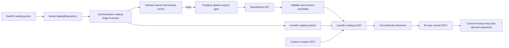

# MusicBrainz and tunedIn Catalog Implementation Plan

Status: implemented and verified locally; ready for pull-request review
Decision date: 2026-07-15
Decision owner: Ethan

## Decision

tunedIn will use MusicBrainz as its primary source for concert artists, places and
areas, songs, and tours. MusicBrainz coverage is incomplete, so a user who cannot
find the correct result may create a durable custom entry in tunedIn's own catalog.

Concerts will never store a one-off user-supplied artist, venue, city, song, or tour
as their identity. Every such value will reference a stable tunedIn catalog UUID.
MusicBrainz-backed entries retain their MBID; custom entries retain tunedIn
provenance and ownership. Display text remains on concert rows only as a
server-derived historical snapshot.

This plan supersedes the external Obsidian MVP document for catalog behavior. It
does not change unrelated product behavior or authorization rules.

## Outcome

The implementation provides:

- Artist, venue, song, and tour controls are search-and-select controls, not saved
  free-text fields.
- A venue determines its catalog area/city; the client cannot submit a mismatched
  city string.
- `create_private_concert` and `update_concert` replacements accept catalog UUIDs,
  positions, dates, and other structured values only.
- MusicBrainz traffic goes through one authenticated Supabase Edge Function with a
  shared one-request-per-second gate, caching, request coalescing, and a meaningful
  User-Agent.
- A missing MusicBrainz result can be added to the user's tunedIn catalog and reused
  in later concerts.
- Existing concerts are preserved by forward-migrating their strings into
  `legacy_import` catalog entries; they are never silently fuzzy-matched.
- Local and CI verification is deterministic and does not call the live MusicBrainz
  service.

## Scope boundary

Catalog-backed values in this phase:

- ordered artists and headliner;
- venue/place and its area/city;
- ordered setlist songs;
- optional tour.

Values that remain user-authored free text:

- comments and photo captions;
- profile username and display name;
- explicit feedback;
- authentication fields;
- transient search queries.

Date, start time, visibility, and IANA time zone remain structured system controls.
MusicBrainz Event import and artwork are not part of the first implementation. An
Event may be added later as an optional accelerator, but it cannot be required
because MusicBrainz event and setlist coverage is incomplete.

## Implemented repository impact

The implementation replaces string identity across the complete write path:

- `ConcertDraft`, create inputs, and update inputs carry resolved catalog selections
  and UUIDs rather than authoritative artist, venue, city, song, or tour strings.
- Creation and editing use one reusable catalog picker plus a typed, reusable custom
  fallback flow. Search text remains transient and is never saved as identity.
- `SupabaseConcertRepository` uses the ID-only v2 concert RPCs. Compatibility wrappers
  remain temporarily available for supported older clients and resolve their strings
  into explicit `legacy_client` catalog records.
- Catalog tables, subtype tables, provenance, cache, request leases, quotas, and the
  application-wide MusicBrainz request gate are enforced in Postgres.
- Concert rows retain server-derived display snapshots for historical rendering and
  indexed archive search while foreign keys remain authoritative.
- Development repositories, SwiftData cache payloads, deterministic seeds, generated
  DTOs, and tests all preserve catalog identities.

The prior security boundary is preserved: direct client writes remain revoked,
concert mutations are transactional hardened RPCs, RLS governs reads, and shared
edits retain optimistic version checks. MusicBrainz provenance can only be assigned
through the service-role gateway path; authenticated users create custom records only
through narrowly scoped hardened RPCs.

## Target architecture



The iOS app never calls `musicbrainz.org` directly and never supplies authoritative
catalog display text to a concert mutation.

## Catalog identity and provenance

Use an internal tunedIn UUID as the permanent identity. An MBID is provenance, not
the application's primary key. This allows MusicBrainz and custom records to share
one mutation contract and allows later merge/reconciliation without changing every
concert reference.

### Base entity

Add `catalog_entities` with:

- `id uuid primary key`;
- `kind`: `artist`, `area`, `place`, `song`, or `tour`;
- `origin`: `musicbrainz`, `tunedin_custom`, `legacy_import`, or
  `legacy_client`;
- `status`: `active`, `needs_review`, `merged`, or `retired`;
- canonical display name/title, sort value, and optional disambiguation;
- nullable MusicBrainz MBID, unique within an entity kind;
- nullable `merged_into_id` for explicit later reconciliation;
- database-managed creation/update timestamps.

Keep creator and ingestion audit data in a private provenance table. Ordinary
catalog reads must not expose which account created a custom value.

### Typed entity tables

Use typed extension tables so concert foreign keys enforce the correct kind:

- `catalog_artists`: MusicBrainz artist type, country/area summary, life-span state;
- `catalog_areas`: area type, country/subdivision codes, optional parent;
- `catalog_places`: area ID, place type, address, coordinates, and ended state;
- `catalog_songs`: optional linked Work MBID, duration, first release date, and
  artist-credit label; the base entity's MBID is the searchable Recording identity;
- `catalog_song_artists`: ordered artist credits and join phrases;
- `catalog_tours`: MusicBrainz Series metadata and artist relationships;
- `catalog_tour_artists`: ordered associated artists.

For songs, Recording is the required MusicBrainz identity because it has materially
better search coverage and artist credits. Store a linked Work MBID when it is
available so later event/setlist work does not require a destructive remap. A custom
song has neither MBID but must be related to at least one catalog artist.

### Concert references and snapshots

Add:

- `concerts.catalog_place_id` (required);
- `concerts.catalog_area_id` (derived from the place and nullable when MusicBrainz
  has no usable area);
- `concerts.catalog_tour_id` (optional);
- `concert_artists.catalog_artist_id` (required);
- `setlist_items.catalog_song_id` (required).

Keep `venue_name`, `city`, `tour`, `artist_name`, and `song_title` as derived
snapshots. They preserve the wording captured at the time, keep archive/feed reads
cheap, and avoid rewriting a user's history when MusicBrainz later renames a place.
Only backend functions copy these values from catalog rows.

Catalog IDs, not snapshot equality, must participate in optimistic-concurrency and
changed-field detection. Replacing one same-named artist with another still counts
as an edit and advances the concert version.

## Custom fallback policy

Custom entries are durable catalog records, not a `Use this text` shortcut.

1. Search results show the user's reusable tunedIn entries first and MusicBrainz
   candidates after them.
2. `Can't find it? Add to tunedIn catalog` opens a dedicated form.
3. A hardened RPC normalizes, validates, de-duplicates, applies a quota, creates or
   returns the catalog entity, and returns its tunedIn UUID.
4. The returned entity becomes the draft selection.

Custom entries are searchable by their creator. They are readable in a shared
concert through its existing visibility rules and may be retained by an authorized
editor of that concert, but they are not automatically suggested globally. This
prevents a typo or joke value from becoming canonical for every account. Global
promotion or merging is a future reviewed operation, not an automatic process.

Minimum custom forms:

- Artist: name, type, optional disambiguation and area.
- Area/city: name plus country/parent context when needed for disambiguation.
- Venue: name, place type, optional address, and an existing or newly created area.
- Song: title and at least one catalog artist; default the picker to the headliner.
- Tour: name and at least one catalog artist; type is fixed to Tour.

Exact duplicate keys are contextual and race-safe. Venue duplicates include area;
song and tour duplicates include artist context. An exact duplicate returns the
existing creator-owned entry. Similar names are suggestions, never automatic
merges.

Custom catalog records are immutable to ordinary clients after creation. A typo is
corrected by creating/selecting a replacement in a normal concert edit. This avoids
silently changing several shared memories at once.

## MusicBrainz gateway

Add one authenticated Edge Function, `music-catalog`, with explicit routes for
search and MusicBrainz candidate resolution.

### Search

- Require a valid tunedIn session and completed profile.
- Accept only an enum entity type, normalized query, bounded page size, offset, and
  explicit artist context for song/tour ranking.
- Require two visible query characters, debounce the iOS caller, cap pages at 15,
  and reject unknown parameters.
- Escape Lucene syntax server-side; the client never constructs MusicBrainz query
  syntax.
- Constrain Recording searches with resolved lineup context. MusicBrainz Series
  search has no equivalent artist-credit field, so remote Tour searches remain
  global while already-saved tunedIn tours use artist context for local ranking.
- Search creator-owned custom/legacy entries locally.
- Return cached MusicBrainz candidates when available.
- On a miss, reserve a shared upstream slot, fetch JSON, validate its size and
  schema, sanitize it, cache it, and return candidates.

### Resolve

A MusicBrainz candidate is not a valid draft selection until resolution succeeds.
The resolve route accepts entity kind plus MBID, performs or reuses an authoritative
lookup, and upserts the normalized entity through a service-role-only RPC. It
returns the tunedIn catalog UUID and display model. Concurrent resolves of one MBID
must converge on the same row.

### Rate limiting and cache

- Enforce MusicBrainz's application-wide average of one request per second with an
  atomic Postgres request-slot allocator shared by every Edge instance.
- Coalesce identical in-flight search/lookup misses so one burst produces one
  upstream request.
- Reject excessive queue delay with a typed retryable response rather than allowing
  Edge invocations to pile up.
- Start with a 24-hour search cache and a 30-day resolved-entity refresh interval.
- Enforce a database-backed per-user search limit; initial recommendation is 120
  catalog searches per rolling hour.
- Enforce custom-creation quotas by entity type. The limits must still permit a
  50-song historical setlist; use configurable counters rather than hard-coding a
  single low total.
- Store a hash of the normalized search request, not the raw query, as the cache
  key. Do not log queries, result names, addresses, MBIDs, response bodies, or
  setlist contents.

### Upstream requirements

Every request uses JSON, a fixed official base URL in hosted environments, bounded
timeouts, and a contactable User-Agent of the form:

```text
tunedIn/<server-version> (<contact-url-or-email>)
```

MusicBrainz currently requires no API key, but its public web service is free for
non-commercial use. Confirm the appropriate MetaBrainz account before a commercial
or revenue-bearing production release. Core database data is CC0; ingest only the
core fields needed by this plan and show a small `Data from MusicBrainz` attribution
in the picker/about surface.

References:

- [MusicBrainz API](https://musicbrainz.org/doc/MusicBrainz_API)
- [Search API](https://musicbrainz.org/doc/MusicBrainz_API/Search)
- [Rate limiting and User-Agent](https://musicbrainz.org/doc/MusicBrainz_API/Rate_Limiting)
- [Place and linked Area](https://musicbrainz.org/doc/Place)
- [Area coverage limitations](https://musicbrainz.org/doc/How_to_Add_Areas)
- [Series and Tour types](https://musicbrainz.org/doc/Series)
- [Event setlist format](https://musicbrainz.org/doc/Event/Setlist)
- [Data licenses](https://musicbrainz.org/doc/About/Data_License)

## Backend mutation contract

Add new, unambiguous RPCs rather than overloading the current PostgREST signatures:

```text
create_private_concert_v2(
  p_artists: [{catalog_artist_id, is_primary}],
  p_catalog_place_id,
  p_concert_date,
  p_catalog_tour_id?,
  p_starts_at?,
  p_venue_time_zone?,
  p_setlist: [{catalog_song_id}]
)

update_concert_v2(
  p_concert_id,
  p_expected_version,
  p_artists: [{catalog_artist_id, is_primary}],
  p_catalog_place_id,
  p_concert_date,
  p_catalog_tour_id?,
  p_starts_at?,
  p_venue_time_zone?,
  p_setlist: [{catalog_song_id}],
  p_visibility
)
```

Both functions retain the existing authentication, onboarding, lineup, setlist,
time-zone, visibility, collaboration, changed-field, event-history, and optimistic
concurrency rules. They additionally reject:

- nonexistent, merged, retired, or wrong-kind catalog IDs;
- forged MusicBrainz provenance;
- a custom entry the caller is not allowed to use;
- a place/area mismatch;
- client-supplied catalog display strings.

Custom creation is handled by narrowly scoped hardened RPCs. MusicBrainz ingestion
is handled by one separate RPC revoked from `public`, `anon`, and `authenticated`
and granted only to `service_role`. Direct catalog insert/update/delete privileges
remain revoked.

## Forward-only data migration

Use expand, migrate, then contract. Never reset a hosted environment.

### 1. Expand

- Create catalog, provenance, rate-limit, cache, and request-gate tables.
- Enable RLS and least-privilege grants.
- Add nullable catalog foreign-key columns to concert tables.
- Add ID-based v2 RPCs and custom creation RPCs.

### 2. Preserve and backfill

- Convert every distinct existing artist string into an owner-scoped
  `legacy_import` artist.
- Convert venue plus city context into an owner-scoped `legacy_import` place/area.
- Convert song title plus primary-artist context into an owner-scoped
  `legacy_import` song.
- Convert tour plus artist context into an owner-scoped `legacy_import` tour.
- Populate every existing concert reference.
- Assert zero missing required references, then make artist, place, and song
  references `NOT NULL`.

Do not fuzzy-match old diary data to MusicBrainz inside a migration. A later
explicit reconciliation can attach an MBID or merge a legacy entry after human
review.

### 3. Support older app builds temporarily

Keep the old string RPC signatures for a bounded compatibility window. They call a
private resolver that finds an exact usable catalog entry or creates an
owner-scoped `legacy_client` custom entry under the same validation and quota rules,
then delegates to the v2 RPC. This keeps old TestFlight builds functional while
ensuring that even their writes receive catalog identities.

The new app never calls these wrappers. Remove them in a later forward migration
after the minimum supported build is enforced and no supported client uses them.

### 4. Contract

- Remove legacy string RPCs and unused text-input helpers.
- Keep derived snapshot columns and indexes.
- Keep invariant tests that prove all structured concert values have catalog IDs.

## iOS implementation

### Domain and repository

- Add app-owned `CatalogArtist`, `CatalogArea`, `CatalogPlace`, `CatalogSong`, and
  `CatalogTour` models with tunedIn UUID, origin, optional MBID, display value, and
  disambiguation metadata.
- Add `MusicCatalogRepository` search, resolve, and custom-create operations.
- Implement `SupabaseMusicCatalogRepository` and deterministic
  `DevelopmentMusicCatalogRepository`.
- Inject the repository through `AppContainer`, root/profile navigation, concert
  creation, and concert editing.
- Keep Supabase and MusicBrainz response shapes out of feature views.

### Reusable picker

Build one catalog picker with entity-specific result rows and shared behavior:

- 400 ms debounce, cancellation, stale-response rejection, pagination, and retry;
- explicit idle, loading, results, empty, offline, rate-limited, and failed states;
- disambiguation using artist type/area, place type/area/address, song artist
  credit/date, and tour artist;
- source labels for MusicBrainz and `Your catalog`;
- candidate resolution before selection;
- custom creation below results, never a raw-query result row;
- contextual bottom Liquid Glass back control and cohesive transitions;
- no loss of the current selection when a later search fails.

### Creation and editing

- Refactor `ConcertDraft` to hold resolved catalog selections.
- `canSave` requires catalog UUIDs for at least one artist and one place.
- Selecting a place renders its area/city read-only in the concert form.
- `Add another artist`, `Add a song`, and `Add tour` open the picker rather than
  appending an empty text field.
- Preserve headliner selection, lineup/setlist reordering, 10-artist limit,
  50-song limit, and existing progressive-disclosure layout.
- Default song search to the lineup/headliner but allow global search for covers.
- Rebuild edit drafts from catalog IDs returned in `ConcertDetail`.
- Bump affected `AppDataCache` payload versions so old Codable snapshots cannot be
  mistaken for the new identity-bearing models.

Archive, feed, and read-only concert views can continue rendering derived snapshots.
Archive text search and sorting continue to use those indexed snapshots.

## Local development plan

Default local and CI behavior is fully deterministic:

- Commit versioned MusicBrainz JSON fixtures for ambiguous artists, places with and
  without areas, recordings with credits, Works, Tours, empty results, redirects,
  malformed data, 503, timeout, and rate-limit cases.
- Run the Edge Function against a local stub selected through a local-only
  `MUSICBRAINZ_BASE_URL`; hosted builds reject non-official upstream origins.
- Seed fixed catalog UUIDs before seeded concerts, including MusicBrainz,
  `tunedin_custom`, and `legacy_import` examples.
- Reuse at least one custom entity across multiple seeded concerts.
- Extend `verify-local-seed.sh` to check foreign keys, snapshot parity, provenance,
  MBID/origin rules, and zero orphaned catalog references.
- Add `make functions-test`, `make local-catalog-verify`, and a function lifecycle
  helper used by `make simulator-local`.
- Add `make simulator-catalog` for deterministic success, ambiguous, empty, slow,
  offline, and rate-limited UI states.
- Keep an opt-in `make musicbrainz-smoke` command for one serialized live query per
  entity. It is never part of required CI or a local reset.

The first implementation of the local function lifecycle is a recurring operational
procedure, so add `supabase/functions/AGENTS.md`, a MusicBrainz runbook, and the
runbook index entry in the same change.

## Shared Development environment plan

The existing `Deploy Development Database` workflow remains migrations-only, as
required by repository policy.

Add a separate manually dispatched `Deploy Development Functions` workflow that:

- runs only from a reviewed `main` commit;
- uses the protected `Development` GitHub Environment;
- runs Deno format/lint/unit tests and disposable backend verification;
- deploys only the allow-listed `music-catalog` function;
- verifies the deployed function/version and records the commit in the job summary;
- never resets/seeds hosted data or deploys unrelated configuration.

Add corresponding read-only plan/status and deploy Make targets. Deployment order
for Development is:

1. merge reviewed additive schema/function/client changes;
2. run `Deploy Development Database` for migrations;
3. run `Deploy Development Functions` for the gateway;
4. run the hosted Development smoke plan with a normal account;
5. use the live Development iOS flow.

The protected environment supplies the contactable MusicBrainz User-Agent value and
any future commercial credential. No such value belongs in the app binary.

Staging already deploys migrations and tracked Edge Functions during its manual
promotion. Extend its preflight to validate MusicBrainz configuration and function
tests before mutation. Do not add automatic deployment on merge.

## Verification plan

### Database and pgTAP

- Service-role-only MusicBrainz ingestion and provenance assignment.
- Authenticated users cannot spoof MBIDs, origins, creator provenance, or direct
  catalog writes.
- Custom creation requires onboarding, normalizes input, de-duplicates safely, and
  enforces concurrent quotas.
- Public reads do not expose custom creator identity.
- Concert v2 RPCs reject arbitrary, wrong-kind, merged, retired, or unauthorized
  catalog UUIDs.
- Snapshot text is derived from selected entities and cannot be supplied by a
  client.
- Venue area/city consistency is enforced.
- Custom and MusicBrainz entities behave identically in owner/editor concert writes.
- Same-name/different-ID edits advance versions and write the correct event.
- Existing lineup, setlist, visibility, collaboration, conflict, block/revocation,
  archive, and activity tests remain green.
- Legacy backfill leaves no missing required IDs.
- Compatibility wrappers always create/reference catalog entities.

### Edge Function and Deno

- Authentication, onboarding, entity allow-lists, query length, page bounds, and
  Lucene escaping.
- Meaningful User-Agent and JSON headers.
- One-request-per-second scheduling under concurrent calls.
- Identical-request single-flight behavior and cache-hit avoidance of upstream.
- Search and lookup TTL behavior.
- Artist, Place/Area, Recording/Work, and Tour decoding from committed fixtures.
- MBID redirects and concurrent resolution converge on one tunedIn UUID.
- Timeout, 429, 503, malformed, and oversized responses map to typed safe failures.
- Logs contain no raw query, result text, address, MBID, URL query string, response
  body, or user content.

### Swift logic and contract tests

- Drafts cannot produce create/update inputs from raw names.
- Encoded v2 payloads contain catalog IDs and positions, not display strings.
- Place selection derives location and cannot submit a mismatched city.
- Candidate resolution is required before draft selection.
- Custom cancel/failure leaves the draft unchanged; success selects and reuses the
  returned UUID.
- Duplicate custom creation selects the existing entry.
- Artist promotion and setlist reordering preserve catalog identity.
- Search debounce, cancellation, stale-response rejection, pagination, offline,
  empty, retry, and rate-limit behavior.
- Development repositories and caches preserve IDs; old cache payloads are evicted
  through version bumps.

### End-to-end local and Simulator

Using a normal seeded account:

- select ambiguous MusicBrainz artist/place/song/tour results;
- verify city derives from place;
- create each custom entity type and reuse it in another concert;
- create, reopen, edit, share, and collaboratively edit the concert;
- verify arbitrary UUID and text-bypass attempts fail;
- exercise empty, slow, offline, upstream-failure, and rate-limited states;
- inspect keyboard behavior, contextual bottom controls, Dynamic Type, VoiceOver
  labels, and iPhone 13 layout;
- relaunch and verify catalog/concert persistence.

Required implementation verification:

```sh
make generate
make lint
make test
make functions-test
make backend-verify
make test-local
```

UI work also requires the affected flow to be exercised and visually inspected in
the iPhone 13 Simulator with Computer Use.

### Hosted Development smoke

- Search ambiguous artist and venue names and inspect disambiguation.
- Verify place-derived city, ordered songs, tour, and custom fallback during an
  upstream outage fixture or controlled failure.
- Reopen, edit, and share the result.
- Run a read-only invariant query proving every required concert reference has an
  active catalog entity and valid origin.
- Review environment-separated sanitized function logs.

## Reviewable implementation delivery

The catalog foundation, gateway, deployment controls, iOS conversion, deterministic
tooling, and verification are delivered together on
`codex/musicbrainz-catalog-plan` as one end-to-end pull request. Keeping the database,
Function, and client contracts together prevents any reviewed commit from describing
only part of the new identity model.

The pull request must not deploy or merge itself. After review and Ethan's explicit
merge permission, deployment remains intentionally ordered and manual:

1. merge the reviewed commit to `main`;
2. dispatch `Deploy Development Database` and verify migration parity;
3. dispatch `Deploy Development Functions` and verify the active `music-catalog`
   version;
4. complete the hosted Development smoke with a normal account; and
5. promote to Staging through its existing protected workflow when approved.

After supported-client adoption, remove the legacy string wrappers in a separate
forward-only cleanup pull request.

## Local verification record

On 2026-07-15 the implementation passed:

- `make generate` and generated Swift DTO drift verification;
- `make lint` with no serious violations and `make workflow-lint`;
- `make functions-test` (41 deterministic Deno tests);
- `make local-catalog-verify` twice, proving stable reusable identities for all five
  entity kinds through a normal authenticated session;
- `make test` and `make test-local` (151 Swift tests in 33 suites on the iPhone 13
  Simulator for both Development and Local configurations);
- `make backend-verify` (312 pgTAP assertions across 14 files, deterministic seed
  invariants, generated DTO parity, and Storage API integration);
- `make simulator-local`, which rebuilt, installed, and launched the app against the
  disposable Local Supabase stack and committed MusicBrainz fixture gateway; and
- an iPhone 13 Computer Use walkthrough covering MusicBrainz artist, place, song,
  and tour resolution; place-derived city; durable custom artist creation and reuse;
  ID-only save; reopening the saved concert; and the catalog-backed edit flow.

No hosted Development, Staging, Production, or live MusicBrainz state was mutated by
this verification.

## Operational, privacy, and release gates

- Choose a contact URL or email for the required MusicBrainz User-Agent before the
  first live Development deployment.
- Confirm non-commercial eligibility or arrange a MetaBrainz commercial account
  before a commercial Production release.
- No new broad telemetry is needed. If catalog failures are instrumented, capture
  only fixed operation, outcome, duration, cache outcome, and error category; use a
  maximum 30-day retention and keep environments separate.
- Do not collect or log search text, catalog names, addresses, song/setlist content,
  MusicBrainz response bodies, or user-created custom text.
- Rollback is forward-only: disable the function or restore the prior function
  version, keep catalog/schema additions in place, and retain the legacy wrappers
  until the new client is proven. Never reset a hosted database.

## Exit condition

The implementation phase is complete when the new client can create and edit concerts
using MusicBrainz or reusable creator-owned custom catalog entries for every scoped
field; all required database references are enforced; legacy data is preserved; local
verification passes; and the iPhone 13 flow is visually verified. Hosted Development
smoke is a post-merge deployment gate. Removal of old string RPCs is a later
supported-client-cutoff cleanup and is not a blocker for this additive rollout.
